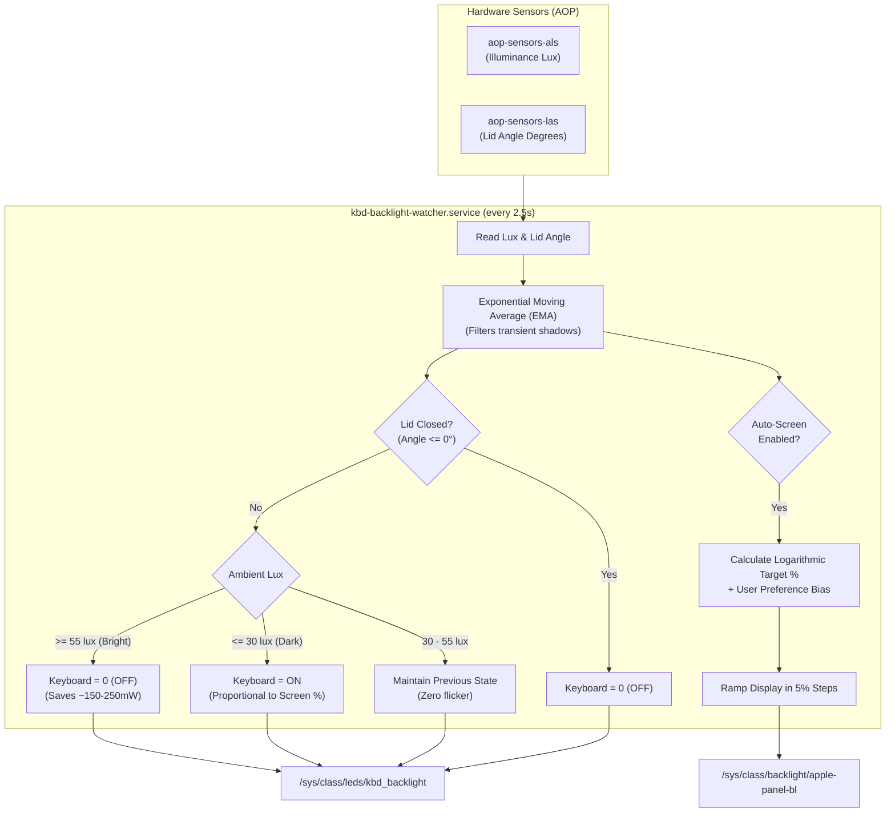

# Ambient Light Sensor (ALS) & Backlight Power Optimization

This document covers the automatic ambient light sensing engine for Apple Silicon Linux that regulates display brightness and keyboard backlight to optimize battery consumption and ergonomic comfort.

---

## 1. Power Analysis & Battery Impact

Laptop backlights represent one of the single largest continuous battery drains:

| Component | Active Power Consumption | Impact of ALS Automation |
| :--- | :--- | :--- |
| **Keyboard Backlight LEDs** | **~100 mW – 300 mW** | **Saves ~150 – 250 mW** in bright rooms (> 55 lux) by turning off LEDs when keys are already visible. |
| **Display Panel Backlight** | **~500 mW – 3,500 mW** | Automatically scales down in dimmer environments, reducing display wattage significantly. |
| **ALS Sensor Hardware (AOP)** | **< 1 mW (microwatts)** | Apple Always-On Processor (AOP) monitors the photodiode in hardware at near-zero power. |
| **Software Polling Overhead** | **~0.001 mW (< 0.02% CPU)** | Direct sysfs read takes **18 microseconds**; sampling every 2.5s costs virtually zero battery. |

> [!NOTE]
> In well-lit environments (e.g. daytime ~485 lux), turning off the keyboard backlight saves **~150 mW to 250 mW**, giving a net battery gain that vastly outweighs the micro-overhead of querying the sensor.

---

## 2. Hardware Interfaces (Apple Silicon M-Series)

- **Ambient Light Sensor (ALS)**:
  `/sys/bus/iio/devices/iio:device1/in_illuminance_input` (provided by `aop-sensors-als`, `apple,t6020-aop-als`).
  Outputs raw illuminance in lux.
- **Lid Angle Sensor (LAS)**:
  `/sys/bus/iio/devices/iio:device0/in_angl_raw` (provided by `aop-sensors-las`).
  Outputs the physical lid opening angle in degrees ($0^\circ$ to $135^\circ$).
- **Display Backlight Controller**:
  `/sys/class/backlight/apple-panel-bl/` (max brightness: `500`).
- **Keyboard Backlight Controller**:
  `/sys/class/leds/kbd_backlight/` (max brightness: `255`).

---

## 3. Automation Architecture



### A. Keyboard Backlight Engine
- **In Bright Light (> 55 lux)**: Key legends are clearly visible from ambient illumination. Backlight turns **OFF** (`0/255`), saving battery power.
- **In Dim Light (< 30 lux)**: Key illumination is required. Backlight turns **ON** and scales proportionally to the display brightness (e.g. 20% screen $\rightarrow$ 20% keyboard, 40% screen $\rightarrow$ 40% keyboard).
- **Hysteresis Band (30 – 55 lux)**: Prevents toggling or flickering caused by minor shadows or moving hands.
- **Clamshell Safety**: When the lid is closed (`angle <= 0`), keyboard LEDs are forced off immediately.

### B. Display Perceptual Curve & User Bias
- Human brightness perception is logarithmic (Weber-Fechner law). The daemon applies a calibrated logarithmic curve:
  $$\text{Target \%} = 5 + 23.75 \cdot \log_{10}(\text{lux}) + \text{user\_bias}$$
- Snaps to exact **5% increments** (e.g. 5%, 10%, 15%... 70%... 100%).
- **User Bias**: When you press <kbd>F1</kbd> or <kbd>F2</kbd>, it shifts your persistent offset ($+5\% / -5\%$) across the entire ambient curve without fighting the daemon.

---

## 4. Configuration & Keybindings

### Configuration File (`~/.config/niri/ambient.conf`)
```ini
# Keyboard Ambient Light Sensor Thresholds (in lux)
kbd_lux_dark = 30        # Below this lux, keyboard backlight turns ON
kbd_lux_bright = 55      # Above this lux, keyboard backlight turns OFF

# Screen auto-brightness: true or false
auto_screen = true

# Screen brightness bounds (percentages: 1 to 100)
screen_min_pct = 5
screen_max_pct = 100

# Polling interval in seconds (2.5s is optimal for battery life)
poll_interval = 2.5
```

### Keybindings (in `~/.config/niri/config.kdl`)
| Shortcut | Action | Description |
| :--- | :--- | :--- |
| <kbd>F1</kbd> / <kbd>BrightnessDown</kbd> | `backlight.sh down` | Step screen down by 5% and shift ambient bias down |
| <kbd>F2</kbd> / <kbd>BrightnessUp</kbd> | `backlight.sh up` | Step screen up by 5% and shift ambient bias up |
| <kbd>Mod</kbd> + <kbd>BrightnessUp</kbd> | `backlight.sh kbd-up` | Increase keyboard proportional scale factor |
| <kbd>Mod</kbd> + <kbd>BrightnessDown</kbd> | `backlight.sh kbd-down` | Decrease keyboard proportional scale factor |
| <kbd>Mod</kbd> + <kbd>Shift</kbd> + <kbd>B</kbd> | `backlight.sh toggle-auto-screen` | Toggle automatic screen brightness on/off |

---

## 5. Verification & Commands

| Action | Command |
| :--- | :--- |
| **Inspect Ambient & Backlight Status** | `~/.config/niri/scripts/backlight.sh status` |
| **Read Raw Room Lux** | `cat /sys/bus/iio/devices/iio:device1/in_illuminance_input` |
| **Read Lid Angle** | `cat /sys/bus/iio/devices/iio:device0/in_angl_raw` |
| **Reset Screen Bias to 0%** | `~/.config/niri/scripts/backlight.sh reset-bias` |
| **Toggle Screen Auto-Brightness** | `~/.config/niri/scripts/backlight.sh toggle-auto-screen` |
| **Check Service Health & CPU Time** | `systemctl --user status kbd-backlight-watcher.service` |
