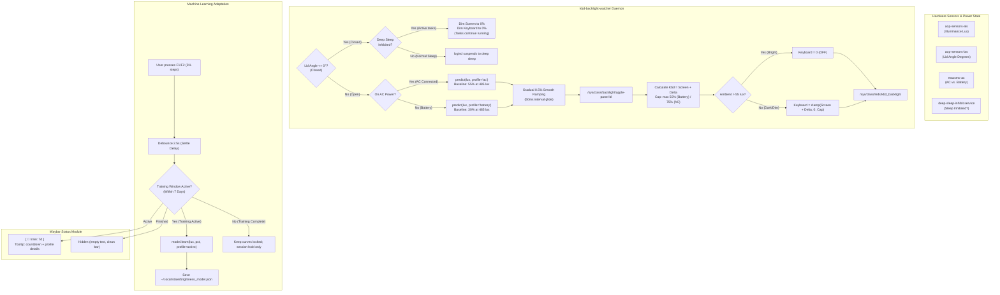

# Ambient Light Sensor (ALS), Dual-Profile ML & Backlight Power Optimization

This document covers the automatic ambient light sensing engine and dual-profile Machine Learning adaptive controller for Apple Silicon Linux that regulates display brightness and keyboard backlight across AC Power and Battery states.

---

## 1. Power Analysis & Battery Impact

Display and keyboard backlights represent the single largest continuous battery drains on Apple Silicon MacBooks:

| Component | Active Power Consumption | Impact of Automation |
| :--- | :--- | :--- |
| **Keyboard Backlight LEDs** | **~100 mW – 300 mW** | **Saves ~150 – 250 mW** in bright rooms (> 55 lux) by shutting off LEDs when keys are already visible. Capped at **50% on Battery** and **75% on AC**. |
| **Display (Battery Profile)** | **~500 mW – 1,200 mW** | Automatically scales to a power-saving **30% baseline** in room lighting (~485 lux), saving **~1.0 W to 1.5 W** compared to high-brightness defaults. |
| **Display (AC Power Profile)** | **~1,200 mW – 3,500 mW** | Automatically scales to a vibrant **55% baseline** in room lighting (~485 lux) to maximize visual quality without battery concern. |
| **Lid-Closed Clamshell State** | **~500 mW – 2,000 mW** | When deep sleep is inhibited for background jobs, dims panel and keyboard to **0%**, saving full display power while tasks continue executing. |
| **ALS Sensor Hardware (AOP)** | **< 1 mW (microwatts)** | Apple Always-On Processor (AOP) monitors the photodiode in hardware at near-zero power. |
| **Software Polling Overhead** | **~0.001 mW (< 0.02% CPU)** | Pure Python standard library implementation; memory footprint is **< 15 MB**. |

---

## 2. Hardware Interfaces (Apple Silicon M-Series)

- **Ambient Light Sensor (ALS)**:
  `/sys/bus/iio/devices/iio:device1/in_illuminance_input` (provided by `aop-sensors-als`, `apple,t6020-aop-als`).
  Outputs real-time illuminance in lux.
- **Lid Angle Sensor (LAS)**:
  `/sys/bus/iio/devices/iio:device0/in_angl_raw` (provided by `aop-sensors-las`).
  Outputs the physical lid opening angle in degrees ($0^\circ$ to $135^\circ$).
- **Power Supply Controller**:
  `/sys/class/power_supply/macsmc-ac/online` and `/sys/class/power_supply/macsmc-battery/` (provided by `macsmc-power`).
- **Display Backlight Controller**:
  `/sys/class/backlight/apple-panel-bl/` (max brightness: `500`).
- **Keyboard Backlight Controller**:
  `/sys/class/leds/kbd_backlight/` (max brightness: `255`).

---

## 3. Automation Architecture



---

## 4. Key Subsystems & Features

### A. Dual-Profile Machine Learning Engine (`adaptive_model.py`)
- **Kernel Anchor Spline**: Pure standard library Python with zero external dependencies (no numpy/scipy).
- **Logarithmic Perceptual Space**: Kernel regression operates in $\log_{10}(\text{lux} + 1)$ perceptual space matching human vision.
- **Strict Monotonicity**: Guarantees that a brighter room never produces a dimmer screen.
- **Dual Calibrated Baselines**:

| Ambient Lux | Environment | Battery Profile Target | AC Power Profile Target |
| :--- | :--- | :--- | :--- |
| `0.0 lux` | Pitch black | **5.0%** (25/500) | **10.0%** (50/500) |
| `5.0 lux` | Very dark room | **10.0%** (50/500) | **15.0%** (75/500) |
| `20.0 lux` | Candlelight / night light | **15.0%** (75/500) | **25.0%** (125/500) |
| `50.0 lux` | Dim indoor | **20.0%** (100/500) | **35.0%** (175/500) |
| `150.0 lux` | Normal indoor | **22.0%** (110/500) | **45.0%** (225/500) |
| **`485.0 lux`** | **Baseline room lighting** | **30.0%** (150/500) *(Power Saver)* | **55.0%** (275/500) *(Vibrant Display)* |
| `1500.0 lux` | Sunlit room / near window | **45.0%** (225/500) | **75.0%** (375/500) |
| `5000.0 lux` | Overcast outdoor | **70.0%** (350/500) | **90.0%** (450/500) |
| `10000.0 lux` | Direct sunlight | **90.0%** (450/500) | **100.0%** (500/500) |

- **Independent Profile Learning**:
  - Manual adjustments on AC power adapt the **AC curve**.
  - Manual adjustments on battery adapt the **Battery curve**.
  - Adjustments settle after 2.5s of inactivity before learning.

### B. Time-Limited Training Window & Waybar Indicator
- **7-Day Training Window**: The system trains for 7 days after activation, then automatically **locks** the curves to prevent long-term drift.
- **Waybar Status Module**:
  - Displays `[ 󰃠 train: 7d ]` in Waybar's left cluster during active training.
  - Rich tooltip displays time remaining, active profile, and learned point counts.
  - Automatically hides (`class: "hidden"`) once training completes, keeping Waybar clean.
  - Clicking the module toggles training mode on/off or resets the training timer.

### C. Gradual Smooth Ramping (0.5% Steps)
- Stepping smoothly by **0.5%** (2.5 units on 500 max) every **50 ms** (~10%/sec transition speed).
- When you plug in or unplug the charger, the screen smoothly transitions between the Battery and AC targets without harsh jumps.
- Ramping aborts immediately if the user touches manual brightness keys.

### D. Continuous Flawless Keyboard Backlight
- **Continuous Hermite Fade (`smoothstep`)**: Completely eliminates jarring binary shutoffs and flickers. Backlight illumination smoothly scales between `kbd_lux_dark` (25 lux, 100% target) and `kbd_lux_bright` (65 lux, 0% daylight shutoff) using a cubic Hermite curve with zero derivatives at the endpoints.
- **Soft Cinematic Ramping**: When target illumination changes (or upon manual adjustment), the keyboard softly glides in ~15 ms steps over ~250–350 ms instead of snapping instantly.
- **Shared EMA Lux Consistency**: Background monitoring and manual keypress handlers read from a shared persistent Exponential Moving Average (`ambient_lux_smoothed`), eliminating transient photodiode noise spikes.
- **Dual Power Caps**:
  - **Battery**: Strictly capped at **50% max** (`128/255`) to eliminate battery waste in dim rooms.
  - **AC Power**: Capped at **75% max** (`191/255`) for enhanced visibility.
- <kbd>Mod</kbd> + <kbd>BrightnessUp</kbd> / <kbd>Down</kbd> (<kbd>F5</kbd>/<kbd>F6</kbd>) adjusts the delta by $\pm 5\%$.

### E. Lid-Close & Deep Sleep Harmony
- **Deep Sleep Mode ON** (`[ 󰒲 sleep on ]`): Closing the lid allows `systemd-logind` to suspend the MacBook into deep sleep as normal.
- **Deep Sleep Mode OFF** (`[ 󰒲 sleep off ]` / Active Tasks): Dims screen to **0%** and keyboard to **0%** while closed, restoring immediately upon reopening without delay.

---

## 5. Configuration & Commands

### Configuration File (`~/.config/niri/ambient.conf`)
```ini
# Ambient Light & Backlight Settings

# Keyboard Ambient Light Sensor Thresholds (in lux)
kbd_lux_dark = 25        # Below this lux, keyboard backlight is at 100% of target
kbd_lux_bright = 65      # Above this lux, keyboard backlight smoothly fades to 0% (OFF)

# Keyboard Follows Screen Settings
kbd_delta_pct = 0        # Keyboard follows screen with this delta (+/- %)
kbd_max_pct_battery = 50 # Strict maximum keyboard brightness cap on Battery (50% = 128/255)
kbd_max_pct_ac = 75      # Maximum keyboard brightness cap on AC Power (75% = 191/255)

# Screen Auto-Brightness Settings
auto_screen = true
screen_min_pct = 5
screen_max_pct = 100

# Smooth Gradual Ramping
smooth_ramp = true
ramp_step_pct = 0.5      # Step size for automatic transitions (0.5% per step)
ramp_interval_ms = 50    # Milliseconds between ramp steps (50ms = 10%/sec glide)

# Machine Learning Dual-Profile Adaptive Model Settings
ml_learning = true       # Learn from manual F1/F2 adjustments
ml_learning_rate = 0.75  # Adaptation speed
ml_settle_delay = 2.5    # Seconds of inactivity after keypress before recording
ml_training_days = 7     # Days of active training before locking curves
ml_training_enabled = true # Training active

# Daemon Polling Interval (seconds)
poll_interval = 2.5
```

### CLI Commands (`~/.config/niri/scripts/backlight.sh`)
| Action | Command |
| :--- | :--- |
| **Inspect System & Ambient Status** | `~/.config/niri/scripts/backlight.sh status` |
| **View Dual ML Models & Anchors** | `~/.config/niri/scripts/backlight.sh model` |
| **Reset Model to Baseline** | `~/.config/niri/scripts/backlight.sh reset-model [all\|battery\|ac]` |
| **Toggle ML Training Mode** | `~/.config/niri/scripts/backlight.sh train-toggle` |
| **Set Training Duration (Days)** | `~/.config/niri/scripts/backlight.sh train [days]` |
| **Force Immediate Resync** | `~/.config/niri/scripts/backlight.sh sync` |
| **Adjust Keyboard Delta (+5% / -5%)** | `~/.config/niri/scripts/backlight.sh kbd-up` / `kbd-down` |
| **Toggle Auto Screen Brightness** | `~/.config/niri/scripts/backlight.sh toggle-auto-screen` |
| **Check Watcher Service Health** | `systemctl --user status kbd-backlight-watcher.service` |
