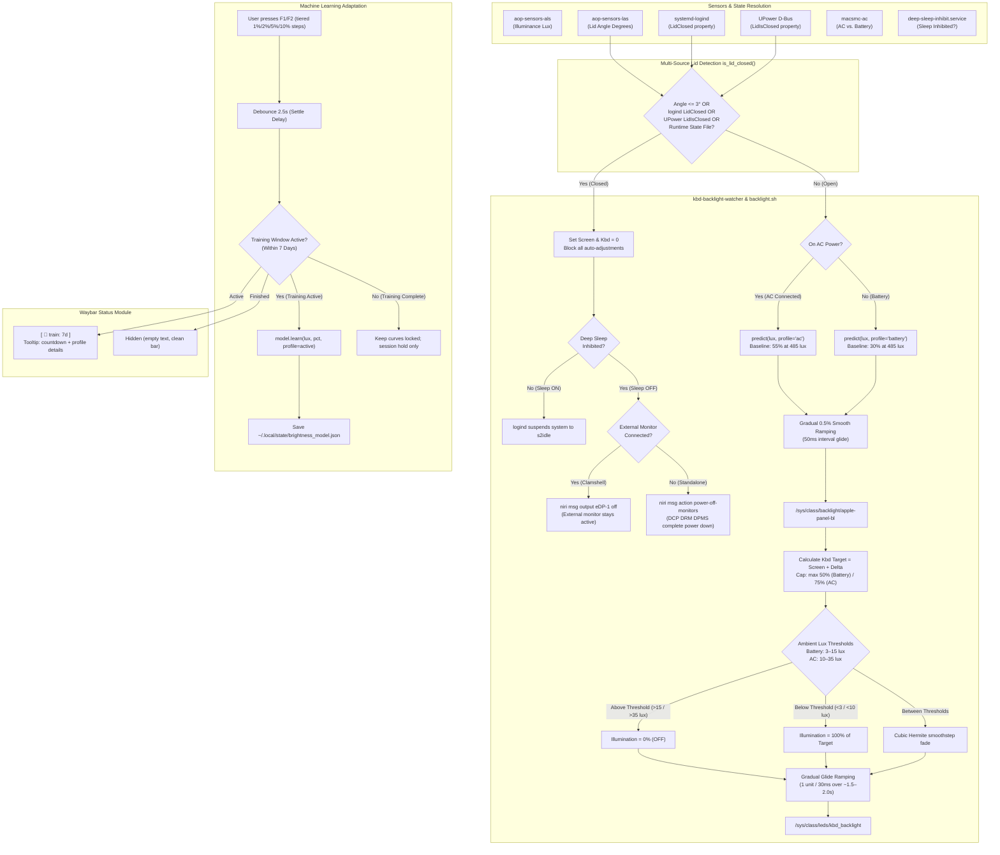

# Ambient Light Sensor (ALS), Dual-Profile ML & Backlight Power Optimization

This document covers the automatic ambient light sensing engine and dual-profile Machine Learning adaptive controller for Apple Silicon Linux that regulates display brightness and keyboard backlight across AC Power and Battery states.

---

## 1. Power Analysis & Battery Impact

Display and keyboard backlights represent the single largest continuous battery drains on Apple Silicon MacBooks:

| Component | Active Power Consumption | Impact of Automation |
| :--- | :--- | :--- |
| **Keyboard Backlight LEDs** | **~100 mW – 300 mW** | **Saves ~150 – 250 mW** by shutting off LEDs when ambient light suffices (completely **0% above 15 lux on Battery**, and **above 35 lux on AC**). Smoothly dissolves over ~1.5–2.0s. Capped at **50% on Battery** and **75% on AC**. |
| **Display (Battery Profile)** | **~500 mW – 1,200 mW** | Automatically scales to a power-saving **30% baseline** in room lighting (~485 lux), saving **~1.0 W to 1.5 W** compared to high-brightness defaults. |
| **Display (AC Power Profile)** | **~1,200 mW – 3,500 mW** | Automatically scales to a vibrant **55% baseline** in room lighting (~485 lux) to maximize visual quality without battery concern. |
| **ProMotion Dynamic Refresh Rate** | **~500 mW – 1,000 mW** | Automatically switches internal panel to **120 Hz on AC Power** (fluid ProMotion experience) and **60 Hz on Battery** (cuts GPU/DCP render workload by 50%), saving **~0.5 W to 1.0 W** on battery. |
| **Idle Screen DPMS Blanking** | **~1,500 mW – 3,500 mW** | `swayidle` automatically powers down monitors via DRM DPMS after 10 minutes of inactivity, waking instantly upon keyboard/mouse input. |
| **Lid-Closed Clamshell / Sleep State** | **~500 mW – 2,500 mW** | In `sleep on` mode, suspends to `s2idle`. In `sleep off` mode (active tasks), dims panel & keyboard to 0% and commands **Niri DRM to power down output (`eDP-1 off` / `power-off-monitors`)**, eliminating the hardware DCP 1% glow and reducing panel power to **0.0 W**. |
| **ALS Sensor Hardware (AOP)** | **< 1 mW (microwatts)** | Apple Always-On Processor (AOP) monitors the photodiode in hardware at near-zero power. |
| **Software Polling Overhead** | **~0.001 mW (< 0.02% CPU)** | Pure Python standard library implementation; memory footprint is **< 15 MB**. |

---

## 2. Hardware Interfaces (Apple Silicon M-Series)

- **Ambient Light Sensor (ALS)**:
  `/sys/bus/iio/devices/iio:device1/in_illuminance_input` (provided by `aop-sensors-als`, `apple,t6020-aop-als`).
  Outputs real-time illuminance in lux.
- **Lid Angle Sensor (LAS)**:
  `/sys/bus/iio/devices/iio:device0/in_angl_raw` (provided by `aop-sensors-las`).
  Outputs the physical lid opening angle in degrees ($0^\circ$ to $135^\circ$).
- **Power Supply Controller**:
  `/sys/class/power_supply/macsmc-ac/online` and `/sys/class/power_supply/macsmc-battery/` (provided by `macsmc-power`).
- **Display Backlight Controller**:
  `/sys/class/backlight/apple-panel-bl/` (max brightness: `500`).
  *Note*: Hardware DCP clamps minimum iDAC at ~1-2 nits; true panel shutoff requires DRM DPMS control via compositor.
- **Keyboard Backlight Controller**:
  `/sys/class/leds/kbd_backlight/` (max brightness: `255`).

---

## 3. Automation Architecture



---

## 4. Key Subsystems & Features

### A. Dual-Profile Machine Learning Engine (`adaptive_model.py`)
- **Kernel Anchor Spline**: Pure standard library Python with zero external dependencies (no numpy/scipy).
- **Logarithmic Perceptual Space**: Kernel regression operates in $\log_{10}(\text{lux} + 1)$ perceptual space matching human vision.
- **Strict Monotonicity**: Guarantees that a brighter room never produces a dimmer screen.
- **Dual Calibrated Baselines**:

| Ambient Lux | Environment | Battery Profile Target | AC Power Profile Target |
| :--- | :--- | :--- | :--- |
| `0.0 lux` | Pitch black | **2.0%** (10/500) | **10.0%** (50/500) |
| `5.0 lux` | Very dark room | **5.0%** (25/500) | **15.0%** (75/500) |
| `20.0 lux` | Candlelight / night light | **10.0%** (50/500) | **25.0%** (125/500) |
| `50.0 lux` | Dim indoor | **18.0%** (90/500) | **35.0%** (175/500) |
| `150.0 lux` | Normal indoor | **22.0%** (110/500) | **45.0%** (225/500) |
| **`485.0 lux`** | **Baseline room lighting** | **30.0%** (150/500) *(Power Saver)* | **55.0%** (275/500) *(Vibrant Display)* |
| `1500.0 lux` | Sunlit room / near window | **45.0%** (225/500) | **75.0%** (375/500) |
| `5000.0 lux` | Overcast outdoor | **70.0%** (350/500) | **90.0%** (450/500) |
| `10000.0 lux` | Direct sunlight | **90.0%** (450/500) | **100.0%** (500/500) |

- **Independent Profile Learning**:
  - Manual adjustments on AC power adapt the **AC curve**.
  - Manual adjustments on battery adapt the **Battery curve**.
  - Adjustments settle after 2.5s of inactivity before learning.

### B. Time-Limited Training Window & Waybar Indicator
- **7-Day Training Window**: The system trains for 7 days after activation, then automatically **locks** the curves to prevent long-term drift.
- **Waybar Status Module**:
  - Displays `[ 󰃠 train: 7d ]` in Waybar's left cluster during active training.
  - Rich tooltip displays time remaining, active profile, and learned point counts.
  - Automatically hides (`class: "hidden"`) once training completes, keeping Waybar clean.
  - Clicking the module toggles training mode on/off or resets the training timer.

### C. Tiered Perceptual Stepping & Gradual Smooth Ramping
- **Tiered Perceptual Manual Stepping**: Screen brightness keys (`F1`/`F2` or `MonBrightnessUp`/`Down`) dynamically scale step sizes based on the current brightness level to match human visual perception:
  - **< 10%**: **1% steps** (fine, ultra-gentle adjustments in pitch black or dim environments).
  - **10% – 20%**: **2% steps** (delicate control in low indoor lighting).
  - **20% – 40%**: **5% steps** (balanced steps in typical indoor lighting).
  - **40% – 100%**: **10% steps** (rapid scaling for bright daylight and outdoor environments).
- **Gradual Smooth Ramping (0.5% Steps)**: Stepping smoothly by **0.5%** (2.5 units on 500 max) every **50 ms** (~10%/sec transition speed) during automatic AC/battery profile shifts or ambient transitions.
- When you plug in or unplug the charger, the screen smoothly transitions between the Battery and AC targets without harsh jumps.
- Ramping aborts immediately if the user touches manual brightness keys.

### D. Continuous Flawless Keyboard Backlight
- **Dual Power Ambient Thresholds**:
  - **Battery (Aggressive Power Saving)**: Full illumination below **3 lux** (pitch darkness), smoothly fading to **completely 0% (OFF) above 15 lux**. Since key markings are easily legible by ambient light even in dim rooms (> 15 lux), this eliminates unnecessary LED power draw.
  - **AC Power (Optimal Experience)**: Full illumination below **10 lux**, smoothly fading to **completely 0% (OFF) above 35 lux**.
- **Continuous Hermite Fade (`smoothstep`)**: Completely eliminates jarring binary shutoffs and flickers. Backlight illumination smoothly scales using a cubic Hermite polynomial ($S(t) = 3t^2 - 2t^3$) with zero derivatives at the endpoints, guaranteeing an elegant, seamless visual fade.
- **Gradual Soft Ramping (~1.5 to 2.0s)**: Rather than shutting off or jumping in a single sudden command, the daemon smoothly steps brightness by **1 unit every 30ms** (taking ~1.5 to 2.0 seconds across typical brightness levels). Transitions are barely perceptible to the naked eye.
- **Shared EMA Lux Consistency**: Background monitoring and manual keypress handlers read from a shared persistent Exponential Moving Average (`ambient_lux_smoothed`), eliminating transient photodiode noise spikes.
- **Dual Power Caps**:
  - **Battery**: Strictly capped at **50% max** (`128/255`) to eliminate battery waste.
  - **AC Power**: Capped at **75% max** (`191/255`) for enhanced visibility.
- <kbd>Mod</kbd> + <kbd>BrightnessUp</kbd> / <kbd>Down</kbd> (<kbd>F5</kbd>/<kbd>F6</kbd>) adjusts the delta by $\pm 5\%$.

### E. Lid-Close & Niri DRM Display Power-Down Architecture

#### The Apple Silicon DCP Hardware Challenge
On Apple Silicon MacBooks running Linux Asahi, the display backlight controller (`apple-panel-bl`) is managed by Apple's Display Coprocessor (DCP). When software attempts to write `0` to `/sys/class/backlight/apple-panel-bl/brightness` while the DRM connector CRTC remains active, the DCP driver triggers a kernel RTKit firmware error:
```
[AFK]nitsToDBV: iDAC out of range
```
The hardware refuses to completely extinguish the mini-LED / Liquid Retina XDR backlight through the brightness register alone, clamping output to the minimum hardware iDAC floor (~1–2 nits, approximately 1% residual glow). This residual glow wastes battery and causes light leakage when the lid is closed in keep-awake mode (`sleep off`).

#### Niri DRM Compositor Integration
To achieve true 0.0 W display power-down, the system integrates directly with Niri's Wayland compositor DRM DPMS controls:
1. **Multi-Monitor / Clamshell Mode**: If an external monitor (HDMI, USB-C/DisplayPort) is connected, closing the lid runs:
   ```bash
   niri msg output eDP-1 off
   ```
   This unbinds the internal panel CRTC completely without disturbing external displays, allowing seamless clamshell desktop workflows.
2. **Standalone Mode**: If no external monitor is attached, closing the lid executes:
   ```bash
   niri msg action power-off-monitors
   ```
   This sends a full DRM DPMS suspend to all outputs, completely cutting power to the display controller and backlight hardware (true 0.0 nits, zero residual glow).
3. **Lid Open / Restoration**: When the lid is reopened, the system executes:
   ```bash
   niri msg action power-on-monitors
   niri msg output eDP-1 on
   ```
   and immediately restores the previous brightness level smoothly.

#### Multi-Source Lid State Resolution (`is_lid_closed()`)
Physical sensors on Apple laptops can suffer from mechanical flex or calibration offsets (e.g. resting at 1°–3° when physically closed). To eliminate false negatives and race conditions with the auto-brightness daemon, `is_lid_closed()` synthesizes 5 distinct signals:
1. **Lid Angle Sensor (`aop-sensors-las`)**: Physical opening angle $\le 3.0^\circ$ (with a $3^\circ$ safety tolerance for resting closure). The sysfs device path is dynamically discovered (`/sys/bus/iio/devices/iio:device*`) to handle reboot enumeration changes.
2. **systemd-logind D-Bus**: Evaluates `org.freedesktop.login1.Manager.LidClosed`.
3. **UPower D-Bus**: Evaluates `org.freedesktop.UPower.LidIsClosed`.
4. **Runtime State File**: Evaluates `${XDG_RUNTIME_DIR}/lid-closed` written synchronously by `backlight.sh lid-close`.
5. **Backlight Guard**: Auto-brightness adjustments and sync loops in `kbd-backlight-watcher` check `is_lid_closed()` on every cycle. Any non-zero brightness write is strictly blocked while the lid is closed, preventing the daemon from waking the screen or keyboard in the dark.

#### Sleep Mode Integration
- **Deep Sleep Mode ON** (`[ 󰒲 sleep on ]`): Closing the lid allows `systemd-logind` to suspend the MacBook into `s2idle` deep sleep as normal.
- **Deep Sleep Mode OFF** (`[ 󰒲 sleep off ]` / Active Tasks): Dims screen and keyboard to **0%**, powers down the DRM output via Niri, and keeps all CPU cores, network sockets, and user background tasks executing at full power with zero display draw.

### F. Dynamic 120Hz/60Hz Refresh Rate & Idle DPMS Blanking

#### Why True 1–120Hz Variable Refresh Rate (VRR) is Not Available on Asahi Linux
In macOS, Apple implements dynamic 1–120Hz ProMotion via closed, proprietary Display Coprocessor (DCP) firmware that continuously adjusts vertical blanking intervals (vblank) per frame in real-time, dropping to 10–24Hz on static screens and boosting to 120Hz during trackpad gestures or scrolling.

Under Linux Asahi, reverse-engineering Apple's DCP has enabled discrete display modes (`3024x1890@120.000`, `60.000`, `59.940`, `50.000`, `48.000`), but the internal eDP DRM connector (`card2-eDP-1`) **does not expose the `vrr_capable` property** to the Linux kernel DRM subsystem (`vrr_supported: false`). While kernel developers are actively exploring experimental patches (`appledrm.force_vrr`), true per-frame adaptive VRR is not yet available or stable for end users.

#### Automated AC vs. Battery Mode Switching
To bridge this gap and maximize battery life without sacrificing smoothness, `waypaper-power-watcher` coordinates automated refresh rate switching via Niri IPC:
- **On AC Power**: Automatically sets `eDP-1` to **120 Hz** (`3024x1890@120.000`), providing the fluid ProMotion experience.
- **On Battery**: Automatically sets `eDP-1` to **60 Hz** (`3024x1890@60.000`). This cuts compositor frame generation, GPU buffer swaps, and DCP packet processing in half, **saving ~0.5 W to 1.0 W of continuous power**.
- Transitions happen in ~10 milliseconds without screen flashes, tearing, or session restarts.

#### Idle Screen DPMS Blanking (`swayidle`)
- Managed as a systemd user service (`swayidle.service`, part of `graphical-session.target`) to monitor user idle state via Wayland's `ext-idle-notify-v1` protocol.
- **Timeout**: Powers off all monitors (`niri msg action power-off-monitors`) after **10 minutes (600s)** of inactivity.
- **Resume**: Restores monitors instantly (`niri msg action power-on-monitors`) upon trackpad touch or keypress.
- **Inhibition**: Automatically respects Wayland idle inhibitors (e.g. video playback in Firefox or media players will not turn off the screen).
- **Status Inspection**: Check with `systemctl --user status swayidle.service` or via `system-menu` -> `idle blanking status`.

---

## 5. Configuration & Commands

### Configuration File (`~/.config/niri/ambient.conf`)
```ini
# Ambient Light & Backlight Settings

# Keyboard Ambient Light Sensor Thresholds on Battery (in lux)
# Aggressive power saving: turns completely OFF in dim rooms where keys are visible
kbd_lux_dark_battery = 3.0       # Below 3 lux (pitch darkness), keyboard backlight is at 100% of target
kbd_lux_bright_battery = 15.0    # Above 15 lux, keyboard backlight smoothly turns completely OFF (0%)

# Keyboard Ambient Light Sensor Thresholds on AC Power (in lux)
kbd_lux_dark_ac = 10.0           # Below 10 lux, keyboard backlight is at 100% of target
kbd_lux_bright_ac = 35.0         # Above 35 lux, keyboard backlight smoothly turns completely OFF (0%)

# Keyboard Gradual Fading (fade speed - replaces single-command shutoff)
kbd_ramp_step = 1                # Step size for keyboard fading (1 unit per step)
kbd_ramp_interval_ms = 30        # Milliseconds per step (30ms = ~1.5-2.0s gradual smooth fade)

# Keyboard Follows Screen Settings
kbd_delta_pct = 0                # Keyboard follows screen with this delta (+/- %)
kbd_max_pct_battery = 50         # Strict maximum keyboard brightness cap on Battery (50% = 128/255)
kbd_max_pct_ac = 75              # Maximum keyboard brightness cap on AC Power (75% = 191/255)

# Screen Auto-Brightness Settings
auto_screen = true
screen_min_pct = 1
screen_max_pct = 100

# Smooth Gradual Ramping
smooth_ramp = true
ramp_step_pct = 0.5      # Step size for automatic transitions (0.5% per step)
ramp_interval_ms = 50    # Milliseconds between ramp steps (50ms = 10%/sec glide)

# Machine Learning Dual-Profile Adaptive Model Settings
ml_learning = true       # Learn from manual F1/F2 adjustments
ml_learning_rate = 0.75  # Adaptation speed
ml_settle_delay = 2.5    # Seconds of inactivity after keypress before recording
ml_training_days = 7     # Days of active training before locking curves
ml_training_enabled = true # Training active

# Daemon Polling Interval (seconds)
poll_interval = 2.5
```

### CLI Commands (`~/.config/niri/scripts/backlight.sh`)
| Action | Command |
| :--- | :--- |
| **Inspect System & Ambient Status** | `~/.config/niri/scripts/backlight.sh status` |
| **View Dual ML Models & Anchors** | `~/.config/niri/scripts/backlight.sh model` |
| **Reset Model to Baseline** | `~/.config/niri/scripts/backlight.sh reset-model [all\|battery\|ac]` |
| **Toggle ML Training Mode** | `~/.config/niri/scripts/backlight.sh train-toggle` |
| **Set Training Duration (Days)** | `~/.config/niri/scripts/backlight.sh train [days]` |
| **Force Immediate Resync** | `~/.config/niri/scripts/backlight.sh sync` |
| **Trigger Lid Close Action** | `~/.config/niri/scripts/backlight.sh lid-close` |
| **Trigger Lid Open Action** | `~/.config/niri/scripts/backlight.sh lid-open` |
| **Adjust Keyboard Delta (+5% / -5%)** | `~/.config/niri/scripts/backlight.sh kbd-up` / `kbd-down` |
| **Toggle Auto Screen Brightness** | `~/.config/niri/scripts/backlight.sh toggle-auto-screen` |
| **Check Watcher Service Health** | `systemctl --user status kbd-backlight-watcher.service` |
| **Check Idle Blanking Service** | `systemctl --user status swayidle.service` |
