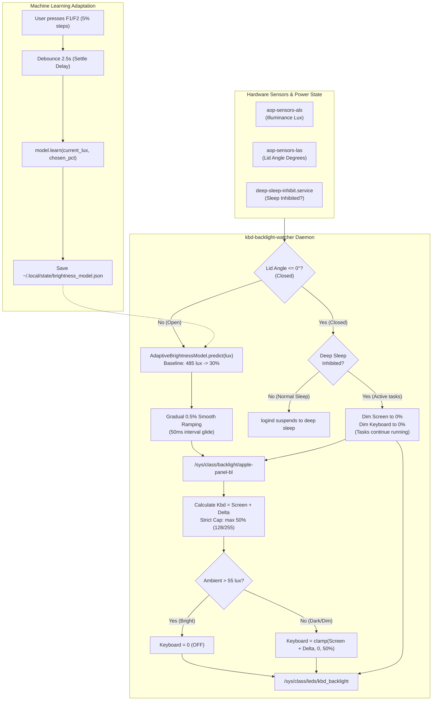

# Ambient Light Sensor (ALS), Adaptive ML & Backlight Power Optimization

This document covers the automatic ambient light sensing engine and Machine Learning adaptive controller for Apple Silicon Linux that regulates display brightness and keyboard backlight to maximize battery life, preserve ergonomic comfort, and harmonize with system sleep states.

---

## 1. Power Analysis & Battery Impact

Display and keyboard backlights represent the single largest continuous battery drains on Apple Silicon MacBooks:

| Component | Active Power Consumption | Impact of Automation |
| :--- | :--- | :--- |
| **Keyboard Backlight LEDs** | **~100 mW – 300 mW** | **Saves ~150 – 250 mW** in bright rooms (> 55 lux) by shutting off LEDs when keys are already visible. Capped at **50% max** to prevent excessive drain in the dark. |
| **Display Panel Backlight** | **~500 mW – 3,500 mW** | Automatically scales down according to a personalized 30% baseline in typical lighting (~485 lux), saving **~1.0 W to 1.5 W** compared to typical high-brightness defaults. |
| **Lid-Closed Clamshell State** | **~500 mW – 2,000 mW** | When deep sleep is inhibited for background jobs, dims panel and keyboard to **0%**, saving full display power while tasks continue executing. |
| **ALS Sensor Hardware (AOP)** | **< 1 mW (microwatts)** | Apple Always-On Processor (AOP) monitors the photodiode in hardware at near-zero power. |
| **Software Polling Overhead** | **~0.001 mW (< 0.02% CPU)** | Pure Python standard library implementation, sysfs reads take microseconds; memory footprint is **< 2 MB**. |

---

## 2. Hardware Interfaces (Apple Silicon M-Series)

- **Ambient Light Sensor (ALS)**:
  `/sys/bus/iio/devices/iio:device1/in_illuminance_input` (provided by `aop-sensors-als`, `apple,t6020-aop-als`).
  Outputs real-time illuminance in lux.
- **Lid Angle Sensor (LAS)**:
  `/sys/bus/iio/devices/iio:device0/in_angl_raw` (provided by `aop-sensors-las`).
  Outputs the physical lid opening angle in degrees ($0^\circ$ to $135^\circ$).
- **Display Backlight Controller**:
  `/sys/class/backlight/apple-panel-bl/` (max brightness: `500`).
- **Keyboard Backlight Controller**:
  `/sys/class/leds/kbd_backlight/` (max brightness: `255`).

---

## 3. Automation Architecture



---

## 4. Key Subsystems & Features

### A. Machine Learning Adaptive Brightness (`adaptive_model.py`)
- **Kernel Anchor Spline**: Implemented in pure Python standard library with zero external dependencies (no numpy/scipy required).
- **Logarithmic Perceptual Space**: Interpolation and kernel regression occur in $\log_{10}(\text{lux} + 1)$ space, aligning with human vision (Weber-Fechner Law).
- **Strict Monotonicity**: Guarantees that a brighter room never produces a dimmer screen.
- **Factory Baseline**: Calibrated for a starting point of **30% screen brightness** (150/500) under typical room lighting (~485 lux):

| Ambient Lux | Environment | Default Target % | Units (/500) |
| :--- | :--- | :--- | :--- |
| `0.0 lux` | Pitch black | 5.0% | 25 |
| `5.0 lux` | Very dark room | 10.0% | 50 |
| `20.0 lux` | Candlelight / night light | 15.0% | 75 |
| `50.0 lux` | Dim indoor | 20.0% | 100 |
| `150.0 lux` | Normal indoor | 22.0% | 110 |
| **`485.0 lux`** | **Baseline room lighting** | **30.0%** | **150** |
| `1500.0 lux` | Sunlit room / near window | 45.0% | 225 |
| `5000.0 lux` | Overcast outdoor | 70.0% | 350 |
| `10000.0 lux` | Direct sunlight | 90.0% | 450 |

- **Learning from Manual Keypresses**:
  - When the user presses <kbd>F1</kbd> or <kbd>F2</kbd>, physical brightness shifts in crisp 5% steps.
  - The watcher waits for a **2.5s settle window** (so multiple rapid presses settle first).
  - The model adjusts local anchors via Gaussian kernel weighting and persists the curve to `~/.local/state/brightness_model.json`.
  - While the ambient lux remains within the same lighting condition, the user's manual brightness is preserved without fighting the daemon.

### B. Gradual Smooth Ramping (0.5% Steps)
- Replaces abrupt 5% jumps with a smooth glide.
- When ambient lighting shifts, screen brightness steps by **0.5%** (2.5 units on 500 max) every **50 ms** (~10%/sec transition speed).
- Ramping aborts immediately if the user touches manual brightness keys.
- Deadband of 1% (5 units) prevents micro-jitter caused by sensor noise.

### C. Keyboard Backlight (Delta Tracking & 50% Hard Cap)
- **Full Daylight Shutoff**: Automatically turns **OFF** (`0/255`) in bright rooms (> 55 lux).
- **Dim Room Auto-On**: Turns **ON** in dim rooms (< 30 lux) with hysteresis between 30 and 55 lux to prevent flickering.
- **Delta Following**: Tracks display brightness plus a configurable delta ($\text{Kbd} = \text{Screen} + \Delta$).
- **Strict 50% Maximum Cap**: Keyboard backlight is strictly capped at **50% max** (`128/255`), preventing excessive power consumption in dark environments.
- <kbd>Mod</kbd> + <kbd>BrightnessUp</kbd> / <kbd>Down</kbd> (<kbd>F5</kbd>/<kbd>F6</kbd>) adjusts the delta by $\pm 5\%$.

### D. Lid-Close & Deep Sleep Harmony
- **Deep Sleep Mode ON** (`[ 󰒲 sleep on ]`):
  - Systemd inhibitor is inactive.
  - Closing the lid allows `systemd-logind` to suspend the MacBook into deep sleep as normal.
- **Deep Sleep Mode OFF** (`[ 󰒲 sleep off ]` / Active Tasks):
  - Inhibitor `deep-sleep-inhibit.service` is active.
  - When the lid is closed (`angle <= 0`), the screen is dimmed to **0%** and keyboard to **0%**, keeping background tasks running while completely extinguishing display power.
  - When the lid is reopened (`angle > 0`), display and keyboard brightness are immediately restored to the ambient target without delay.

---

## 5. Configuration & Commands

### Configuration File (`~/.config/niri/ambient.conf`)
```ini
# Ambient Light & Backlight Settings

# Keyboard Ambient Light Sensor Thresholds (in lux)
kbd_lux_dark = 30        # Below this lux, keyboard backlight turns ON
kbd_lux_bright = 55      # Above this lux, keyboard backlight turns OFF

# Keyboard Follows Screen Settings
kbd_delta_pct = 0        # Keyboard follows screen with this delta (+/- %)
kbd_max_pct = 50         # Strict maximum keyboard brightness cap (50% = 128/255)

# Screen Auto-Brightness Settings
auto_screen = true
screen_min_pct = 5
screen_max_pct = 100

# Smooth Gradual Ramping
smooth_ramp = true
ramp_step_pct = 0.5      # Step size for automatic transitions (0.5% per step)
ramp_interval_ms = 50    # Milliseconds between ramp steps (50ms = 10%/sec glide)

# Machine Learning Adaptive Model Settings
ml_learning = true       # Learn from manual F1/F2 adjustments
ml_learning_rate = 0.75  # Adaptation speed
ml_settle_delay = 2.5    # Seconds of inactivity after keypress before recording

# Daemon Polling Interval (seconds)
poll_interval = 2.5
```

### CLI Commands (`~/.config/niri/scripts/backlight.sh`)
| Action | Command |
| :--- | :--- |
| **Inspect System & Ambient Status** | `~/.config/niri/scripts/backlight.sh status` |
| **View Adaptive ML Model & Anchors** | `~/.config/niri/scripts/backlight.sh model` |
| **Reset ML Model to 30% Baseline** | `~/.config/niri/scripts/backlight.sh reset-model` |
| **Force Immediate Resync** | `~/.config/niri/scripts/backlight.sh sync` |
| **Adjust Keyboard Delta (+5% / -5%)** | `~/.config/niri/scripts/backlight.sh kbd-up` / `kbd-down` |
| **Toggle Auto Screen Brightness** | `~/.config/niri/scripts/backlight.sh toggle-auto-screen` |
| **Toggle Deep Sleep Mode** | `~/.config/waybar/scripts/deep-sleep-toggle.sh --toggle` |
| **Check Watcher Service Health** | `systemctl --user status kbd-backlight-watcher.service` |
