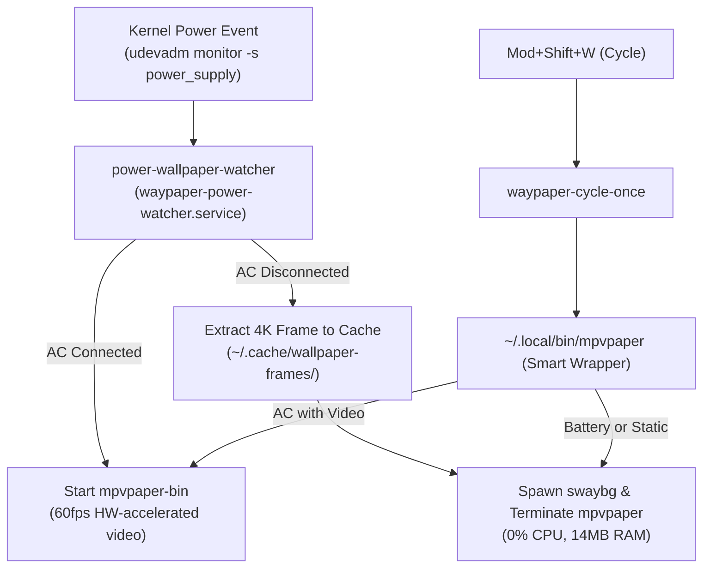

# Dynamic Wallpaper Power Optimization

This document details the wallpaper subsystem optimization that switches between live 60fps video playback on AC power and ultra-low-power static image rendering on battery.

---

## 1. Problem Statement & Baseline Metrics

`mpvpaper` is a versatile Wayland wallpaper tool capable of rendering video wallpapers via OpenGL and `mpv`. However, running it unconstrained on a laptop battery presented severe power penalties:

| Metric | Unoptimized `mpvpaper` | Optimized (`swaybg` on battery) | Savings / Delta |
| :--- | :--- | :--- | :--- |
| **CPU Usage** | 1.5% – 6.0% (constant rendering) | **0.0%** | **~100% reduction** |
| **RAM Consumption** | 175 MB – 1.3 GB | **~14 MB** | **>92% memory freed** |
| **Threads Active** | 17 background threads | **1 thread** | **16 threads eliminated** |
| **Context Switches** | >33,000 / sec | **< 10 / sec** | **Massive CPU idle gain** |
| **GPU / Compositor Load** | Active OpenGL subsurfaces | **Static buffer (no repaints)** | **GPU sleeps** |

---

## 2. Architecture & Components

### A. Smart Wrapper (`~/.local/bin/mpvpaper`)
The real compiled `mpvpaper` binary was renamed to `~/.local/bin/mpvpaper-bin`. In its place, a smart dispatcher wrapper inspects the hardware power line:
- **On Battery OR with static image files (`.jpg`, `.png`, `.webp`)**:
  Kills any running `mpvpaper-bin` processes and launches `/usr/bin/swaybg` targeting the selected file (or its extracted video frame).
- **On AC Power with video files (`.mp4`, `.webm`, `.mkv`)**:
  Kills `swaybg` and launches `mpvpaper-bin` with hardware acceleration enabled (`--hwdec=auto --no-audio`).

### B. Dynamic Power Transition Daemon (`power-wallpaper-watcher`)
- **Service**: `~/.config/systemd/user/waypaper-power-watcher.service`
- **Script**: `~/.config/waypaper/scripts/power-wallpaper-watcher`
- Uses `udevadm monitor -u -s power_supply` to wait asynchronously for hardware AC plug/unplug events without busy polling.
- When on battery, extracts a pristine 4K video frame (`ffmpeg -ss 00:00:01 -vframes 1 -q:v 2`) and saves it to `~/.cache/wallpaper-frames/<filename>.jpg`.
- Instantly swaps from video to static frame without screen flash.

### C. Manual Wallpaper Cycling (`waypaper-cycle-once`)
- Bound to <kbd>Mod</kbd> + <kbd>Shift</kbd> + <kbd>W</kbd> in Niri.
- Calls `waypaper --random` through the smart dispatcher without hanging on socket timeouts or leaving orphaned processes.

### D. Dynamic Accent Color Extraction (`set-wallpaper-accent`)
- Script: `~/.config/waypaper/scripts/set-wallpaper-accent`
- Extracts color palettes and updates Pywalfox, Niri borders (`accent.kdl`), and Waybar CSS live without restarting applications.

---

## 3. Verification & Troubleshooting

| Check | Command | Expected State |
| :--- | :--- | :--- |
| **Active Wallpaper Process** | `ps aux \| grep -E "mpvpaper\|swaybg" \| grep -v grep` | `swaybg` on battery; `mpvpaper-bin` on AC |
| **Watcher Service Status** | `systemctl --user status waypaper-power-watcher.service` | Active (running), < 5MB memory |
| **Frame Cache Inspection** | `ls -lh ~/.cache/wallpaper-frames/` | High-quality `.jpg` frames for video wallpapers |
| **Manual Cycle Test** | `~/.config/waypaper/scripts/waypaper-cycle-once` | Wallpaper changes and theme updates |
