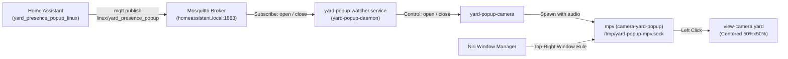

# Yard Camera Presence Popup Notification

An automated live-view video notification system for the yard camera (`rtsp://192.168.1.206:554/stream1`) running on **Niri Wayland**, integrated with **Home Assistant** and **Mosquitto MQTT**.

---

## Overview

When presence is detected outside or when the perimetral beam sensors are triggered, a live mid-small floating camera popup appears at the top-right border of your screen with full audio. It automatically stays on screen until dismissed or until no occupancy has been detected for 10 seconds.

```
┌─────────────────────────────────────────────────────────────┐
│ Screen (Niri Wayland)                    ┌────────────────┐ │
│                                          │ Yard Camera    │ │
│                                          │ [Live + Audio] │ │
│                                          │ 28% × 28%      │ │
│                                          └────────────────┘ │
│                                                             │
│                                                             │
│                                                             │
└─────────────────────────────────────────────────────────────┘
```

---

## Behavior & Controls

### Triggers & Cooldown
1. **Occupancy Detected (Person, Car, etc.)**: `binary_sensor.yard_all_occupancy` transitions to `on`.
   - **3-Minute Debounce / Cooldown**: Evaluates a template condition checking that the yard has been clear of occupancy for at least 3 minutes before popping up again. This prevents the popup from continuously opening and closing if someone is moving in and out of frame.
2. **Perimetral Beam Sensors Triggered**: `binary_sensor.perimetral_sensors` transitions state. Always triggers without cooldown.

### Dismissal Modes
- **Automatic Auto-Close**: Once no occupancy is detected in the yard frame for **10 continuous seconds**, the popup automatically closes.
- **Manual Keyboard Close**: Move the mouse over the window (focused automatically via Niri's `focus-follows-mouse`), then press <kbd>Mod</kbd>+<kbd>Q</kbd> (or <kbd>q</kbd>).
- **Non-Intrusive**: Spawns with `open-focused false` so it never steals keyboard focus while you are typing.

### Click-to-Expand (Promote to Centered View)
- **Click the popup** with left mouse button:
  - Immediately closes the small notification.
  - Opens the standard centered **Yard Camera** window (`50% × 50%` in the middle of the screen), identically to launching Yard from Fuzzel (see [RTSP Camera Viewers](README.md)).

---

## Architecture & Data Flow



---

## Component Details

### 1. Home Assistant Automation
- **Category**: `Linux` (Category ID: `01M1PAVHJPZBYN9H1V08C83SZ1`)
- **Automation ID**: `automation.yard_presence_popup_linux`
- **Mode**: `restart`
- **Triggers**:
  - `binary_sensor.yard_all_occupancy` (`to: on`)
  - `binary_sensor.perimetral_sensors` (`to: [off, on]`)
  - `binary_sensor.yard_all_occupancy` (`to: off` for `00:00:10`)
- **Conditions**:
  ```yaml
  condition: or
  conditions:
    - condition: trigger
      id:
        - perimetral_sensors_triggered
        - occupancy_cleared
    - condition: template
      value_template: >-
        {{ (trigger.from_state is not defined) or
           (trigger.from_state is none) or
           ((now() - trigger.from_state.last_changed).total_seconds() >= 180) }}
  ```
- **Actions**: Calls `mqtt.publish` on topic `linux/yard_presence_popup` with payload `open` or `close`.

### 2. Niri Window Rule ([`~/.config/niri/config.kdl`](file:///home/davideresigotti/.config/niri/config.kdl))
```kdl
window-rule {
    match app-id=r#"^camera-yard-popup$"#
    open-floating true
    default-floating-position x=24 y=24 relative-to="top-right"
    open-focused false
}
```

### 3. MPV Input Configuration ([`~/.config/niri/scripts/yard-popup-input.conf`](file:///home/davideresigotti/.config/niri/scripts/yard-popup-input.conf))
```
MBTN_LEFT run "/home/davideresigotti/.local/bin/view-camera" "yard" ; quit
```
Maps single left-click to promote to standard centered camera view.

### 4. Camera Controller Script ([`~/.local/bin/yard-popup-camera`](file:///home/davideresigotti/.local/bin/yard-popup-camera))
CLI utility used by the daemon and available for manual testing:
```bash
# Open popup
yard-popup-camera open

# Close popup
yard-popup-camera close

# Check status (returns 0 if running, 1 if stopped)
yard-popup-camera status
```

### 5. Background Daemon ([`~/.config/niri/scripts/yard-popup-daemon`](file:///home/davideresigotti/.config/niri/scripts/yard-popup-daemon))
Python client using `paho-mqtt` that maintains a resilient connection to Mosquitto, receives `open`/`close` commands, and delegates to `yard-popup-camera`.

### 6. Systemd User Service ([`~/.config/systemd/user/yard-popup-watcher.service`](file:///home/davideresigotti/.config/systemd/user/yard-popup-watcher.service))
Manages lifecycle of the daemon:
```bash
# View service status
systemctl --user status yard-popup-watcher.service

# View live service logs
journalctl --user -u yard-popup-watcher.service -f

# Restart service
systemctl --user restart yard-popup-watcher.service
```

---

## Stream Specification & Optimization

- **RTSP URL**: `rtsp://192.168.1.206:554/stream1`
- **Video**: HEVC (H.265) 2560×1440 @ 25 fps, `--hwdec=no` (Apple Silicon ARM NEON CPU decoding, < 1-2% CPU).
- **Audio**: PCM Mu-law (`pcm_mulaw` 8 kHz mono), streamed live through PipeWire.
- **Transport**: `--rtsp-transport=tcp` to eliminate packet loss and gray artifacting over Wi-Fi.
- **Sizing**: `--autofit=28%x28%` (maintains native 16:9 aspect ratio at mid-small scale).
